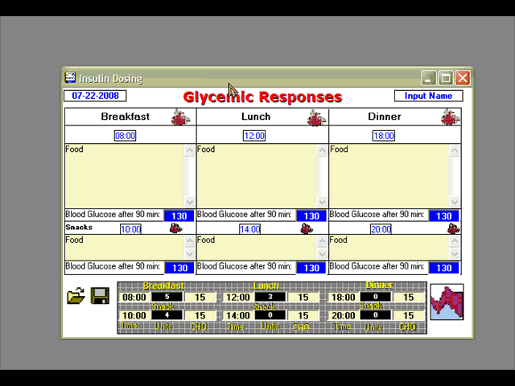



## Diabetes Care Insulin, Blood Sugar, Carbs Graph

### Description

Update(7-20-2008): Fixed Saving File, Disclaimer added, May now view data by day, week, month, etc...Next updates will likely include Insulin dosage adjustments, patient education, Nutritional education. Update(7-15-08): I left out the short data file. The screenshot was incomplete and fixed. The graph displays the values at the cursor and opens the particular record when clicked. One may zoom and contract the view as well...This is the initial part of a comprehensive medical Diabetes care program. At present, one inputs meal data, blood sugars, insulin dosage, gms carbohydrate and times. This is then plotted against time in a three tiered line graph. One may optimize and adjust therapy using this. It will likely be linked with an email option and autoresponder to send/receive from a care-giver's computer. Insulin titration information may be added but I am hesitant to put this on the patient side of the program. In addition, calculating gmCHO, glycemic index and Hba1c data will be added.
 
### More Info
 

             |
---                |---
**Submitted On**   |2008-07-20 04:00:08
**By**             |[Warren Goff](https://github.com/Planet-Source-Code/PSCIndex/blob/master/ByAuthor/warren-goff.md)
**Level**          |Beginner
**User Rating**    |5.0 (10 globes from 2 users)
**Compatibility**  |VB 6\.0
**Category**       |[Complete Applications](https://github.com/Planet-Source-Code/PSCIndex/blob/master/ByCategory/complete-applications__1-27.md)
**World**          |[Visual Basic](https://github.com/Planet-Source-Code/PSCIndex/blob/master/ByWorld/visual-basic.md)
**Archive File**   |[Diabetes\_C2121137202008\.zip](https://github.com/Planet-Source-Code/warren-goff-diabetes-care-insulin-blood-sugar-carbs-graph__1-70823/archive/master.zip)

